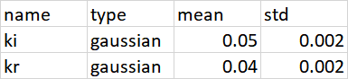
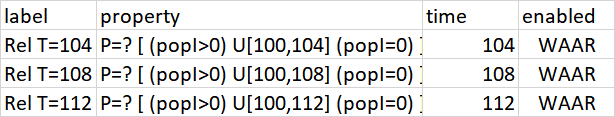
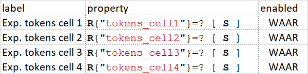

# Sampling-Based Verification of CTMCs with Uncertain Rates (SLURF)

This is an implementation of the approach proposed in the paper:

- [1] "Sampling-Based Verification of CTMCs with Uncertain Rates" by Thom Badings, Sebastian Junges, Nils Jansen, Marielle Stoelinga, and Matthias Volk, CAV 2022

## Installation

- Install [Storm](https://www.stormchecker.org/documentation/obtain-storm/build.html) and [Stormpy](https://moves-rwth.github.io/stormpy/installation.html#installation-steps) using the instructions in the documentation.
  Note that one must use the master branches of both tools.
  Preferably, install these in a virtual environment.

- Install dependencies: on macOS, tkinter needs to be available.
  It can be installed via [Homebrew](https://brew.sh/):

  `brew install python-tk`

- Install Slurf using

  `python setup.py install`

- Run the tests using

  `pytest test`

## How to run for a single model?

A miminal command to run a single CTMC or fault tree is as follows:

```
python runfile.py --N=<number of samples> --beta=<confidence level> --model=<path to model file>
```

The `model` argument should contain the path to the model file (e.g., in PRISM format), rooted in the `model` folder. For example, to run for `N=100` samples of the SIR epidemic model with a population of 20 and a confidence probability of `beta=0.99` (i.e., the obtained results via scenario optimization are correct with at least 99% probability), the following command may be executed:

```
python runfile.py --N=100 --beta=0.99 --model=ctmc/epidemic/sir20.sm
```

The `model` argument is mandatory, while the number of samples is `N=100` by default, and the default confidence probability if `beta=0.99`. For details on all possible arguments and their default values, see below.

### Parameter distribution and property files

Besides the model specification file, SLURF requires two additional Excel files, which must be located in the same folder as the model:

- A parameter probability distribution file: `parameters.xlsx` by default, but a manual file can be passed as follows: `--param_file filename.xlsx`
- A property definition file: `properties.xlsx` by default, but a manual file can be passed as follows: `--prop_file filename.xlsx`

The parameter distribution file defines the probability distributions of the parameters. For example, the `parameters.xlsx` for the SIR20 CTMC model looks as follows:



Here, `ki` and `kr` are the parameter names, `type` can either be `gaussian`, in which case we pass a `mean` and `std`, or it can be `interval` in which case we definee a `lb` and `ub` column for the lower and upper bounds (see the `parameters.xlsx` file for the Kanban CTMC for an example with interval distributions).

The properties file defines the properties that are verified by Storm. We can either pass a list of properties with only varying timebounds, or a list of independent properties. For the SIR20 CTMC, only the timebounds vary, so the `properties.xlsx` file looks as follows:



By contrast, for the Kanban CTMC, we pass 4 independent properties, yielding the file:



Note that in both cases, the `enabled` column should be set to `TRUE` in order for the property to be verified by Storm.

### Multiple expected reward measures

- For models with multiple reward structures, bisimulation should be disabled. You can do this by providing the optional argument `--no-bisim`.

### Constructing Pareto-curves

Besides computing rectangular confidence regions (which is the default), SLURF can also construct a Pareto-front or -curve on the computed solution vectors. To do so, set the option `--pareto_pieces n`, where `n` is an integer that describes the number of linear elements in the Pareto-front. For `n=0`, a default rectangular confidence region is computed.

### Inspecting results

The results for individual experiments are saved in the `output/` folder, where a folder is created for each run of the script. In this experiment folder, you will find all related figures, and an Excel file with the raw export data.

## How to run experiments?

We now describe how to reproduce the experimental section of [1].


## List of possible arguments

Optional arguments

Other optional arguments are as follows:

- `--rho_min 0.0001` - Minimum cost of violation to start with in first iteration (0.0001 by default)
- `--rho_incr 1.5` - Increment factor of the cost of violation in every iteration (1.5 by default)
- `--rho_max_iter 20` - Maximum number of iterations for increasing cost of violations (20 by default)
- `--curve_plot_mode conservative` - Plotting mode for reliability curves. Is either `optimistic` or `conservative` (default)
- `--Nvalidate 0` - If provided, an empirical Monte Carlo validation (with the provided number of solutions) of the bounds on the satisfaction probability is performed.


