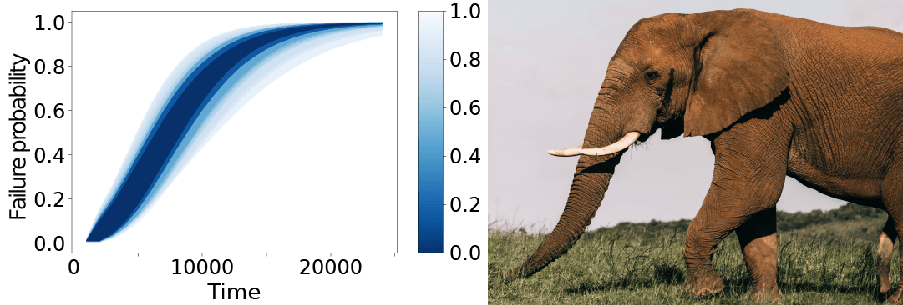

# Sampling-Based Verification of CTMCs with Uncertain Rates (SLURF)

This is an implementation of the approach proposed in the paper:

- [1] "Sampling-Based Verification of CTMCs with Uncertain Rates" by Thom Badings, Sebastian Junges, Nils Jansen, Marielle Stoelinga, and Matthias Volk, CAV 2022

Our implementation is called SLURF, named after the resemblance between a typical result figure and the trunk of an elephant, which is called a *slurf* in Dutch (Photo by [Rachel Claire](https://www.pexels.com/nl-nl/@rachel-claire/) via [Pexels](https://www.pexels.com/nl-nl/foto/voedsel-natuur-zonnig-veld-4577802/?utm_content=attributionCopyText&utm_medium=referral&utm_source=pexels)):



## 1. Installation from source

While for users, we recommend to use SLURF via the Docker container, you can also build SLURF from source as follows:

- Install [Storm](https://www.stormchecker.org/documentation/obtain-storm/build.html), [pycarl](https://moves-rwth.github.io/pycarl/installation.html#installation-steps) and [stormpy](https://moves-rwth.github.io/stormpy/installation.html#installation-steps) using the instructions in the stormpy documentation.

  Note that one must use at least version 1.7.
  Preferably, install pycarl and stormpy in a virtual environment.

- Install dependencies: on macOS, tkinter needs to be available.
  It can be installed via [Homebrew](https://brew.sh/):

  `brew install python-tk`

- Install SLURF using

  `python setup.py install`

## 2. Run SLURF using a Docker container

We provide a docker container. We assume you have Docker installed (if not, see the [Docker installation guide](https://docs.docker.com/get-docker/)). Then, run:

```
docker pull thombadings/slurf:cav22
```

or in case you downloaded this container from an (unpacked) archive:

```
docker load -i slurf_cav22_docker.tar
```

Our Docker container is built upon a container for the probabilistic model checker Storm (see [this documentation](https://www.stormchecker.org/documentation/obtain-storm/docker.html) for details).

To use the docker container, open a terminal and navigate to the folder where you want to save the results in. Then, run the following command (for Windows platforms, please see the [documentation on the Storm website](https://www.stormchecker.org/documentation/obtain-storm/docker.html#run-the-docker-image-windows)):

```
docker run --mount type=bind,source="$(pwd)",target=/opt/slurf/output -w /opt/slurf --rm -it --name slurf thombadings/slurf:cav22
```

You will see a prompt inside the docker container. The README in this folder is what you are reading. Now you are ready to run the code for a single model (Section 3) or to replicate the experiments presented in [1] (Section 4).

## 3. How to run for a single model?

A miminal command to run a single CTMC or fault tree is as follows:

```
python runfile.py --N <number of samples> --beta <confidence level> --model <path to model file>
```

The `model` argument should contain the path to the model file, rooted in the `model` folder. For defining parametric CTMCs, we support [the PRISM format](https://prismmodelchecker.org/manual/ThePRISMLanguage/Introduction), while for parametric fault trees, we support [the Galileo format](https://www.cse.msu.edu/~cse870/Materials/FaultTolerant/manual-galileo.htm#Editing%20in%20the%20Textual%20View). See Section 6 for how the parameters in these models are defined.

To run for 100 samples of the SIR epidemic model with a population of 20 and a confidence probability of 0.99 (i.e., the obtained results via scenario optimization are correct with at least 99% probability), the following command may be executed:

```
python runfile.py --N 100 --beta 0.99 --model ctmc/epidemic/sir20.sm
```

The `model` argument is mandatory, while the number of samples `N` is 100 by default, and the default confidence probability `beta` is 0.99. For details on all possible arguments and their default values, see below.

### Parameter distribution and property files

Besides the model specification file, SLURF requires two additional Excel or CSV (semi-colon separated) input files. In this ReadMe, we use Excel input files, but CSV input files work in an equivalent way (make sure that the CSV file is semi-colon separated). The input files must be located in the same folder as the model:

- A parameter probability distribution file: `parameters.xlsx` by default, but a manual file can be passed as follows: `--param_file filename`
- A property definition file: `properties.xlsx` by default, but a manual file can be passed as follows: `--prop_file filename`

The parameter distribution file defines the probability distributions of the parameters. For example, the `parameters.xlsx` for the SIR20 CTMC model looks as follows:

| name  | type     | mean | std   |
| ---   | ---      | ---  | ---   |
| ki    | gaussian | 0.05 | 0.002 |
| kr    | gaussian | 0.04 | 0.002 |

Here, `ki` and `kr` are the parameter names, `type` can either be `gaussian`, in which case we pass a `mean` and `std`, or it can be `interval` in which case we definee a `lb` and `ub` column for the lower and upper bounds (see the `parameters.xlsx` file for the Kanban CTMC for an example with interval distributions).

The properties file defines the properties that are verified by Storm. We can either pass a list of properties with only varying timebounds, or a list of independent properties. For the SIR20 CTMC, only the timebounds vary, so the `properties.xlsx` file looks as follows:

| label     | property                             | time | enabled |
|-----------|--------------------------------------|------| ---     |
| Rel T=104 | P=? [ (popI>0) U[100,104] (popI=0) ] | 104  | TRUE    |
| Rel T=108 | P=? [ (popI>0) U[100,108] (popI=0) ] | 108  | TRUE    |
| ...       | ...                                  | ...  | ...     |

By contrast, for the Kanban CTMC, we pass multiple independent properties, yielding the `properties.xlsx` file:

| label                 | property                      | enabled |
| ---                   | ---                           | ---     |
| Exp. tokens cell 1    | R{"tokens_cell1"}=? [ S ]     | TRUE    |
| Exp. tokens cell 2    | R{"tokens_cell2"}=? [ S ]     | TRUE    |
| Exp. tokens cell 3    | R{"tokens_cell3"}=? [ S ]     | TRUE    |
| Exp. tokens cell 4    | R{"tokens_cell4"}=? [ S ]     | TRUE    |

Note that in both cases, the `enabled` column should be set to `TRUE` in order for the property to be verified by Storm.

### Multiple expected reward measures

- For models with multiple reward structures, bisimulation should be disabled. You can do this by providing the optional argument `--no-bisim`.

### Constructing Pareto-curves

Besides computing rectangular confidence regions (which is the default), SLURF can also construct a Pareto-front or -curve on the computed solution vectors. To do so, set the option `--pareto_pieces n`, where `n` is an integer that describes the number of linear elements in the Pareto-front. For `n=0`, a default rectangular confidence region is computed.

### Inspecting results

The results for individual experiments are saved in the `output/` folder, where a folder is created for each run of the script. In this experiment folder, you will find all related figures, and several csv files (or a single Excel file, if this extension was specified) with the raw export data.

## 4. How to run experiments?

The figures and tables in the experimental section of [1] can be reproduced by running one the shell scripts in the `experiments` folder:

- `cd experiments; bash run_experiments.sh` runs the full experiments as presented in [1]. Expected run time: multiple days.
- `cd experiments; bash run_experiments_partial.sh` runs a partial set of experiments. Expected run time: 3 hours.

Before running the experiments, we recommend to remove any existing files/folders in the `output/` folder (except the `.keep` file). 

Note that warnings may pop up (related to the model checker Storm), but these can safely be ignored.

### Run times

- With the expected run times in mind, we recommend running the partial set. The partial set of experiments uses reduced numbers of solution vectors and less repetitions for each experiment.
- If you want to run the full experiment set anyways, you can reduce the number of repetitions per experiment to reduce the run time. To do this, open one of the respective shell scripts in the `experiments` folder, and reduce the value of variable `reps`, e.g. to `reps=2`.
- The default timeout of one hour (set in `table4_statistics.sh` / `table4_statistics_partial.sh`) may not be enough to run some benchmarks (e.g., Kanban 5; see Table 1 in [1]) in the full experiment set. If desired, you can increase the timeout for these experiments to finish.

### Inspecting experiment results
Both scripts run 5 experiments, which we now discuss one by one. All tables are stored in CSV format in the folder `output/` (which is the shared Docker folder, when using SLURF via the run command above). Partial tables are stored with the suffix `_partial` in the filename.

1. Creating all figures presented in [1]. The figures are saved in the `output/` folder, where a subfolder is created for each experiment, e.g. `sir60_N=400_date=2022-05-05_14-17-30`. Within these subfolders, you will find the experiment figures, saved as .pdf files.
2. Benchmark statistics. The table (corresponding with Tables 1 and 4 in [1]) is saved as `benchmark_statistics.csv`.
3. Tightness of obtained lower bounds. The tables (corresponding with Table 2 in [1]) are saved as `table2_kanban.csv` and `table2_rc.csv`.
4. Scenario optimization run times. The tables (corresponding with Table 3 in [1]) are saved as `table3_kanban.csv` and `table2_rc.csv`.
5. Comparison to naive Monte Carlo baseline. The table (corresponding with Table 5 in [1]) is saved as `naive_baseline.csv`.

## 5. List of possible arguments

Below, we list all arguments that can be passed to the command for running SLURF. Arguments are given as `--<argument name> <value>`.

| Argument    | Required? | Default          | Type                     | Description |
| ---         | ---       | ---              | ---                      | ---         |
| N           | No        | 100              | int. or list of integers | Number of solution vectors. A list can be passed as e.g., `[100,200]` |
| beta        | No        | [0.9,0.99,0.999] | float or list of floats  | Confidence level. A list can be passed as e.g., `[0.9,0.99]` |
| rho_list    | No        | --depends--      | float of floats          | Lists of the costs or relaxation to use, e.g. `[0.2,0.5,0.75,1.5]` |
| model       | Yes       | n/a              | string                   | Model file, e.g. `ctmc/epidemic/sir20.sm` |
| param_file  | No        | parameters.xlsx  | string                   | File to load parameter distributions from |
| prop_file   | No        | properties.xlsx  | string                   | File to load properties from |
| no-bisim    | No        | False            | bool                     | If this argument is added, bisimulation is disabled |
| seed        | No        | 1                | int                      | Random seed |
| Nvalidate   | No        | 0                | int                      | Number of solution vectors to use in computing empirical containment probabilities (as in Table 2 in [1]) |
| dft_checker | No        | concrete         | string                   | Type of DFT model checker to use (either `concrete` or `parametric`) |
| precision   | No        | 0                | float >= 0               | If specified (and if bigger than zero), approximate model checker is used |
| naive_baseline   | No   | False            | bool                     | If this argument is added, comparison with a naive Monte Carlo baseline is performed |
| export_stats| No        | None             | string                   | If this argument is added, benchmark statistics are exported to the specified file |
| export_filetype| No     | csv              | string                   | Extension of files to export results to (can be `csv` or `xlsx`) |
| refine      | No        | False            | bool                     | If this argument is added, the iterative refinement scheme is enabled |
| refine_precision | No   | 0                | float                    | Refinement precision to be used for refining solutions (0 means refining to exact solution vectors) |
| plot_timebounds | No    | None             | str                      | List of two timebounds to create 2D plot for (note: these should be present in the properties Excel or CSV file!) |
| curve_plot_mode | No    | conservative     | str                      | If `conservative`, overapproximation of curves are plotted over time; if `optimistic`, underapproximations are plotted |
| pareto_pieces | No      | 0                | int                      | If nonzero, a pareto front is plotted, with a front consisting of the specified number of linear pieces |

## 6. Defining parametric models

SLURF supports uncertain parametric CTMCs (defined in PRISM format) and fault trees (defined in Galileo format). For example, the SIR epidemic model CTMC is defined as follows:

```
ctmc

const double ki;
const double kr;

const int maxPop = 20;
const int initS = maxPop-5;
const int initI = 5;
const int initR = 0;

module SIR

popS: [0..maxPop] init initS;
popI: [0..maxPop] init initI;
popR: [0..maxPop] init initR;

<>popS > 0 & popI > 0 & popI < maxPop  ->    ki*popS*popI  : (popS'= popS-1) & (popI'= popI+1);
<>popI > 0 & popR < maxPop ->    kr*popI  : (popR'= popR+1) & (popI'= popI-1);
<>popI=0 -> 1 : true;

endmodule

label "done" = popI=0;
```

There are two parameters, `ki` and `kr`. As described in Section 3, the parameter distributions are defined in a separate Excel or CSV file. 

Similarly, the following is the DCAS dynamic fault tree, in Galileo format:

```
param P;
param B;
param CS;
param SS;
param MS;
param MA;
param MB;
param PA;
param PB;
param PS;
toplevel "System";
"System" or "FDEP" "CPU" "MOTOR" "PUMPS";
"FDEP" fdep "TRIGGER" "P" "B";
"TRIGGER" or "CS" "SS";
"CPU" wsp "P" "B";
"MOTOR" or "SWITCH" "MOTORS";
"SWITCH" pand "MS" "MA";
"MOTORS" csp "MA" "MB";
"PUMPS" and "PUMP1" "PUMP2";
"PUMP1" csp "PA" "PS";
"PUMP2" csp "PB" "PS";
"P" lambda=P dorm=0;
"B" lambda=B dorm=0.5;
"CS" lambda=CS dorm=0;
"SS" lambda=SS dorm=0;
"MS" lambda=MS dorm=0;
"MA" lambda=MA dorm=0;
"MB" lambda=MB dorm=0;
"PA" lambda=PA dorm=0;
"PB" lambda=PB dorm=0;
"PS" lambda=PS dorm=0;
```

The original non-parametric fault tree which we adapted can be found in the [FFORT benchmark suite](https://dftbenchmarks.utwente.nl/ffort.php). Other benchmarks from this suite can be converted to a parametric model in a similar way.

## 6. Rebuilding the Docker container

The included Docker image of SLURF is based on the Stormpy image (by the storm developers, see [this documentation](https://www.stormchecker.org/documentation/obtain-storm/docker.html) for details). If, one makes changes to the source code of SLURF, the docker container must be built again, using the included Dockerfile. Rebuilding the SLURF image can be done by executing the following command in the SLURF directory (here, 1.0 indicated the version):

``` 
docker build -f Dockerfile --tag slurf:1.0 .
```
